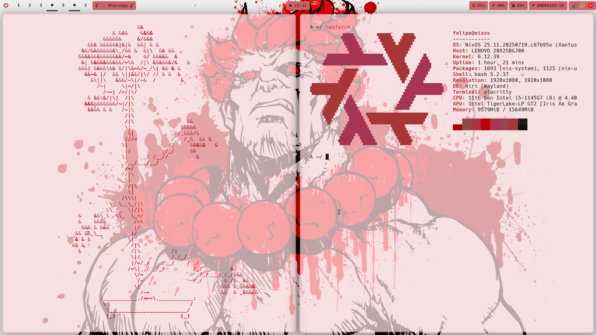

# NixOS Configuration

This repository contains my NixOS configuration, including Home Manager and various system settings. It's designed to provide a fast, secure, and reproducible environment.

## Features

- Niri window manager with custom keybindings and rules
- Waybar for a Wayland-compatible status bar
- Alacritty terminal emulator with custom themes
- Zsh shell with Oh My Zsh and custom plugins
- Dunst for notifications
- Niri's built-in compositor
- Yazi file manager
- Fuzzel for window switching
- Vial for keyboard firmware configuration
- Docker setup
- Stylix theme for a consistent look

## Screenshot

This screenshot shows the desktop environment with Niri, Waybar, and Alacritty terminal.
