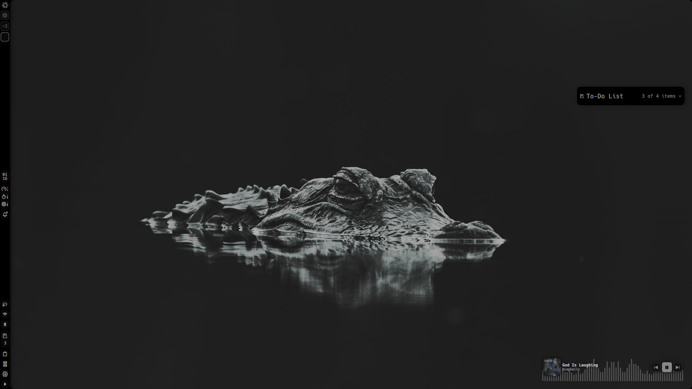
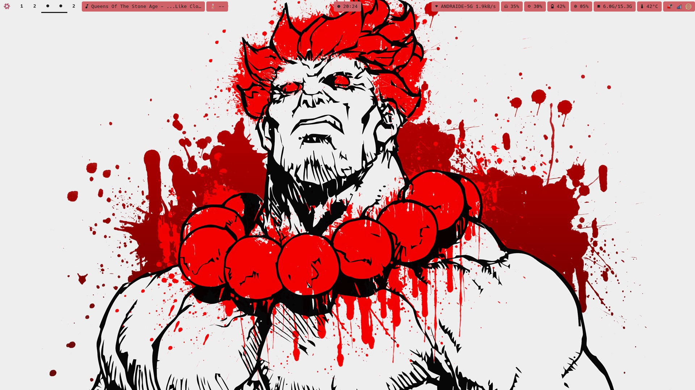
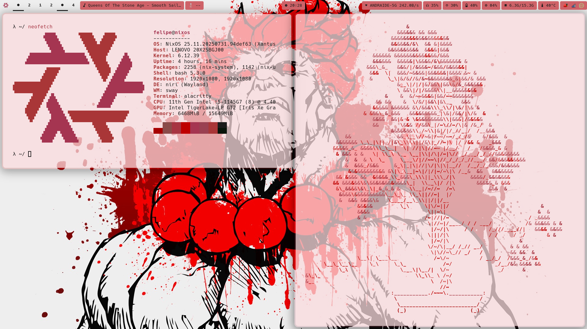
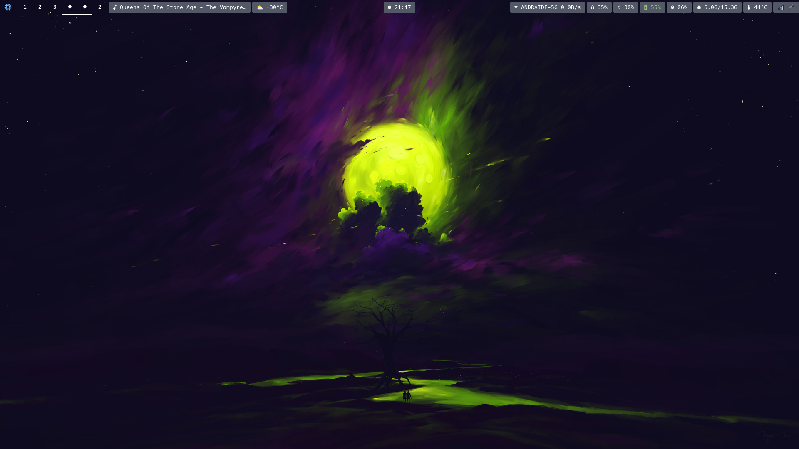
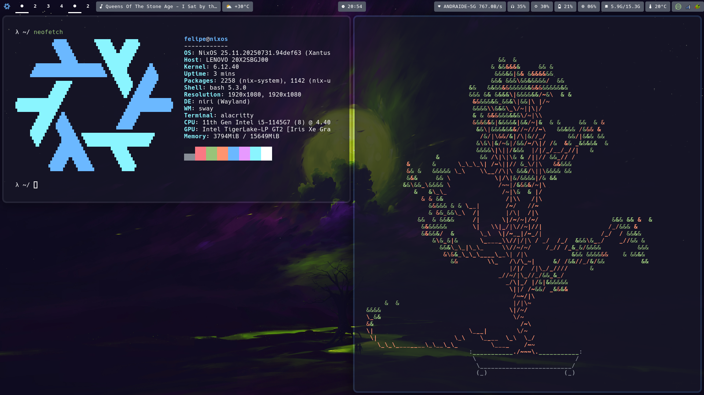

<p align="center">
  <a href="https://niri.app/">
    
  </a>
  <a href="https://nixos.wiki/wiki/Flakes">
    
  </a>
  <a href="https://nixos.org/">
    
  </a>
</p>

<p align="center"></p>

<h2 align="center">NixOS Configuration</h2>

## ❄️ <samp>COMPONENTS</samp>

- **Window Manager** • [Niri](https://niri.app/) - Scrollable tiling Wayland compositor
- **Desktop Shell** • [Noctalia](https://github.com/noctalia-dev/noctalia-shell) - Unified status bar, notifications, and app launcher
- **Terminal** • [Ghostty](https://ghostty.org/) / [Alacritty](https://alacritty.org/) - GPU-accelerated terminal emulators
- **Shell** • [Zsh](https://www.zsh.org/) with [Oh My Zsh](https://ohmyz.sh/) - Powerful shell framework
- **Editor** • [Neovim](https://neovim.io/) (with [NixCats](https://github.com/BirdeeHub/nixCats-nvim)) / [VSCode](https://code.visualstudio.com/) - Text editors
- **File Manager** • [Yazi](https://github.com/sxyazi/yazi) - Blazing fast terminal file manager
- **Theme** • [Stylix](https://github.com/danth/stylix) - System-wide theming for NixOS
- **Wallpaper** • [Gowall](https://github.com/flick0/gowall) - Dynamic wallpaper generator

## 📁 <samp>STRUCTURE</samp>

```
nix-config/
├── flake.nix              # Main flake configuration
├── hosts/                 # Host-specific configurations
│   └── nixos/            # Main machine config
│       ├── default.nix
│       └── hardware-configuration.nix
├── modules/
│   ├── nixos/            # System-level modules
│   │   ├── core/        # Essential system (networking, substituters)
│   │   ├── desktop/     # Desktop environment (stylix, niri, gtk)
│   │   ├── hardware/    # Hardware-specific (upower, vial)
│   │   ├── programs/    # System programs (steam, wine, packages)
│   │   └── services/    # System services (docker, jellyfin)
│   └── home-manager/     # User-level modules
│       ├── desktop/
│       │   ├── window-managers/  # Window managers (niri, i3)
│       │   ├── bars/             # Status bars
│       │   ├── launchers/        # App launchers
│       │   ├── notifications/    # Notification systems
│       │   └── compositors/      # Compositors
│       ├── programs/
│       │   ├── terminals/    # Terminal emulators
│       │   ├── editors/      # Text editors
│       │   ├── shells/       # Shell configurations
│       │   ├── browsers/     # Web browsers
│       │   └── utilities/    # Utility programs
│       └── profiles/         # Complete user profiles
├── assets/
│   ├── wallpapers/       # Wallpaper collection
│   └── screenshots/      # System screenshots
└── home-manager/
    └── home.nix          # Home-manager entry point
```

## � <samp>INSTALLATION</samp>

### Quick Start

```bash
# Clone the repository
git clone https://github.com/Jheickson/nix-config
cd nix-config

# Build and switch to the new configuration
sudo nixos-rebuild switch --flake .#nixos

# Or for home-manager only
home-manager switch --flake .#felipe
```

### First Time Setup

1. Install NixOS with flakes enabled
2. Clone this repository
3. Update `hosts/nixos/hardware-configuration.nix` with your hardware config
4. Modify `hosts/nixos/default.nix` to suit your needs
5. Run the installation command

## 🎨 <samp>CUSTOMIZATION</samp>

### Changing Theme
Edit `modules/nixos/desktop/stylix.nix`:
```nix
wallpaperSource = ../../../assets/wallpapers/YourCategory/wallpaper.png;
themeFile = "${pkgs.base16-schemes}/share/themes/your-theme.yaml";
```

### Adding Packages
Edit `modules/nixos/programs/packages.nix` to add system packages or create new module files in the appropriate category.

### Modifying Window Manager
Window manager configurations are in `modules/home-manager/desktop/window-managers/`.

## 💻 <samp>SCREENSHOTS</samp>

<p align="center">
<!-- 
 -->

</p>
<p align="center">
<!-- 
 -->
</p>

## ✨ <samp>FEATURES</samp>

- 🎯 **Modular Structure** - Organized by function for easy navigation and maintenance
- 🔧 **Flakes Support** - Reproducible builds with Nix flakes
- 🎨 **Beautiful Theming** - System-wide theming with Stylix
- 🚀 **Optimized** - Fastboot times and responsive system
- 📱 **Wayland Native** - Full Wayland support with Niri compositor
- 🔒 **Declarative** - Everything configured in code
- 🏠 **Home Manager** - User environment management
- 🎮 **Gaming Ready** - Steam, Wine, and gaming tools included

## 🎩 <samp>ACKNOWLEDGEMENTS</samp>

This configuration was inspired by and built with knowledge from:

- [NixOS Official Documentation](https://nixos.org/manual/nixos/stable/)
- [Home Manager Documentation](https://nix-community.github.io/home-manager/)
- [Stylix](https://github.com/danth/stylix) - System-wide theming
- [Niri](https://niri.app/) - Scrollable-tiling Wayland compositor
- The amazing NixOS community on GitHub, Reddit, and Discord
- Various dotfiles repositories that showed what's possible

## 📝 <samp>NOTES</samp>

- This configuration is tailored for my specific setup but can be easily adapted
- Wallpapers are included in `assets/wallpapers/` organized by category
- The configuration is organized for multi-machine support (add new hosts easily)
- Most commented-out packages in `packages.nix` have been tested and work

## 🤝 <samp>CONTRIBUTING</samp>

Feel free to open issues or PRs if you find bugs or have suggestions for improvements!

<pre align="center">
<a href="#readme">BACK TO TOP</a>
</pre>

<p align="center"></p>
